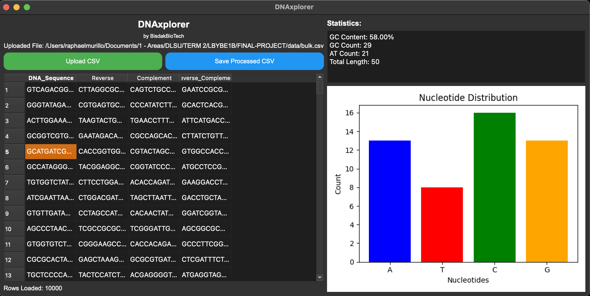

# DNAxplorer

## Overview

DNAxplorer is a Python-based, DNA Sequence Processor, application with a graphical user interface (GUI) built using PyQt5. The app processes DNA sequences from a CSV file and provides various functionalities, including reverse, complement, and reverse-complement generation, as well as statistical and visual analyses of nucleotide distributions.



## Features

-   **Upload DNA Sequences:** Import a CSV file containing DNA sequences.
-   **Reverse and Complement Operations:** Generate reverse, complement, and reverse-complement sequences for each DNA sequence.
-   **Save Processed Data:** Export the processed DNA sequences as a new CSV file.
-   **Sequence Statistics:** View detailed statistics for any selected DNA sequence:
    -   GC Content Percentage
    -   GC and AT Nucleotide Counts
    -   Total Sequence Length
-   **Nucleotide Visualization:** Display a bar chart of nucleotide distribution for any selected sequence.

## Installation

### Prerequisites

Ensure that the following are installed on your system:

-   Python 3.7+
-   pipenv (for managing dependencies)

### Steps

1. Clone the repository:

    ```bash
    git clone <repository-url>
    cd <repository-directory>
    ```

2. Install dependencies using pipenv:

    ```bash
    pipenv install
    ```

3. Activate the virtual environment:

    ```bash
    pipenv shell
    ```

4. Run the application:
    ```bash
    python main.py
    ```

## Usage

1. **Launch the App:** Start the application by running the `main.py` script.
2. **Upload a File:** Click on the "Upload CSV" button to import a CSV file with a column named `DNA_Sequence`.
3. **View Processed Data:** The table will display the reverse, complement, and reverse-complement sequences for each entry.
4. **Select a Row:** Click on any DNA sequence in the table to view its statistics and a nucleotide distribution chart in the sidebar.
5. **Save Data:** Click "Save Processed CSV" to export the table to a new CSV file.

## File Format

The input CSV file must contain at least one column named `DNA_Sequence` with valid DNA sequences (composed of A, T, C, and G characters).

Example:
| DNA_Sequence |
|--------------------|
| ATCGGACT |
| TGCATGCA |
| GCGTATAC |

## Dependencies

The following Python libraries are required for the application:

-   pandas
-   matplotlib
-   PyQt5

## Troubleshooting

1. **Missing PyQt5**: If you encounter errors related to PyQt5, ensure it is installed using the following command:
    ```bash
    pipenv install PyQt5
    ```
2. **Invalid CSV Format**: Ensure the CSV file contains a column named `DNA_Sequence` with valid sequences.
3. **Mac Issues with PyQt5**: If running on macOS, ensure the necessary GUI dependencies are installed.

## License

This project is open-source and available under the MIT License.

## Acknowledgments

Submitted to: Sir Selverino Magon

As part of the final project requirement for LBYBE1B (Computer Programming 1 for BME)

Feel free to contribute to this project by submitting issues or pull requests!
